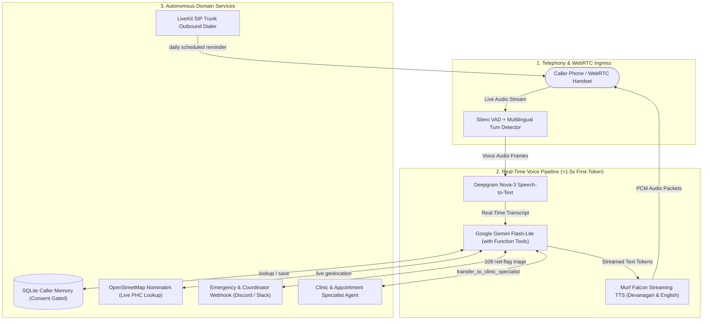

# Aanya — Real-Time Multilingual Voice AI Health Advisor

[](pyproject.toml)
[](https://livekit.io)
[](https://murf.ai)
[](https://deepgram.com)
[](https://aistudio.google.com)
[](https://github.com/astral-sh/ruff)
[](tests/)
[](LICENSE)

> **Architect & Maintainer:** [Harshit Dubey](https://github.com/HarshitD0501)  
> **Production Core:** LiveKit Agents • Murf Falcon TTS • Deepgram Nova-3 • Google Gemini • Silero VAD

---

## ⚡ System Architecture & Real-Time Voice Flow



---

## 📊 Pipeline Component & Latency Benchmarks

| Component | Provider / Engine | Model / Configuration | Operational Role | Benchmark Latency |
| :--- | :--- | :--- | :--- | :--- |
| **Transport** | LiveKit RTC | Real-Time SFU / SIP Bridge | Low-latency bi-directional WebRTC & SIP audio | `< 25ms` |
| **Voice Activity** | Silero VAD | `silero_vad v5` | Pre-warmed frame-accurate speech detection | `< 30ms` |
| **Turn Detection** | LiveKit ML | Multilingual Turn Detector | Natural pause evaluation across Hindi & English | `150ms - 300ms` |
| **Transcription** | Deepgram | `nova-3` | Streaming multilingual STT with noise filtering | `250ms - 350ms` |
| **Reasoning / LLM** | Google Gemini | `gemini-3.5-flash-lite` | Clinical triage logic, scope enforcement, tool choreography | `~1.45s (TTFT)` |
| **Speech Synthesis** | Murf AI | Falcon Streaming TTS (`Anisha`) | Ultra-fast natural Hindi & Indian-English voice | `180ms - 260ms` |
| **Store / Analytics** | SQLite | WAL-mode connection pool | Audit logging, reminders, escalations, memory | `< 5ms` |

---

## 🔁 Core Workflow Engines

### 1. Inbound Voice Triage Flow

```
[Caller Speaks] 
       │
       ▼
[Language Match Engine] ──► English ────────────► Conversational English Advice
       │                ──► Hindi / Hinglish ───► Strict Devanagari Script (देवनागरी)
       ▼
[Caller Memory Lookup] ──► Found ──────────────► Personalized Return Greeting
       │                ──► New Caller ────────► Scope Assessment First
       ▼
[Clinical Scope Gate]  ──► In-Scope ───────────► Plain-Language Wellness Triage
                        ──► Out-of-Scope ───────► Honest Boundary Statement
                                                 (Refuse drugs/diagnosis)
```

- **Zero-Shot Language Matching:** Dynamic detection of language; Hindi is strictly synthesized via Devanagari script for accent authenticity.
- **Strict Name Policy:** Caller name spoken strictly in opening greeting and closing farewell—never repeated incessantly in middle turns.
- **Consent-Gated Memory:** Health details (`age_band`, `ongoing_conditions`, `last_triage_outcome`) saved only after explicit caller confirmation.

---

### 2. Outbound Medication Adherence Dialer Flow

```
[Cron / Scheduler] ──► Evaluates Due Window (Window: 10m, Concurrency: 1)
       │
       ▼
[Pre-Dispatch Worker] ──► Agent Claimed in Room (Avoids pickup latency clipping)
       │
       ▼
[SIP Trunk Dial Leg] ──► Rings Callee (Twilio / Linphone SIP Target)
       │
       ▼
[Dual-Signal Answer Race] 
       ├── Signal A: LiveKit Carrier SIP 200 OK
       └── Signal B: Room Metadata Poller ("sip_answered": true)
       │
       ▼
[Deterministic Spoken Opening] (Built in code, not improvised by LLM)
  "नमस्ते [Name] जी, मैं आन्या बोल रही हूँ — आपकी हेल्थ रिमाइंडर सेवा से..."
       │
       ├── Callee says "हाँ, दवा ले ली" ────────► Log: Medicine Taken
       ├── Callee asks medical question ────────► Switches to live triage
       └── Callee says "रिमाइंडर बंद करो" ──────► Opt-Out Tool Fires (Hard Disabled)
```

#### Outbound Outcome & Automated Retry Matrix

| Dial Outcome | Detection Signature | Automated Retry Policy | Operational Rationale |
| :--- | :--- | :--- | :--- |
| `answered` | Human connected & produced transcript | None | Dose reminder successfully delivered |
| `no_answer` | SIP `408` / `480` / `487` or 30s timeout | `3×` every 15 min | Caller away from phone |
| `quick_hangup` | Picked up and dropped `< 5.0s` | `2×` every 10 min | Callee hung up before engagement |
| `possible_voicemail` | SIP answered but zero transcript | None | Message already on voicemail; avoid re-dial |
| `rejected` | SIP `486` Busy / `603` Decline | None | Deliberate decline; zero-harassment rule |
| `trunk_failure` | Telephony carrier / transport error | `2×` every 5 min | Infrastructure recovery backoff |
| `opted_out` | Spoken opt-out phrase triggered | **Permanent Stop** | Instant suppression; overrides all retry rules |

---

### 3. Emergency & Human Escalation Protocol Flow

```
[Symptom Triage Analysis]
       │
       ├── Red-Flag Emergency: Chest Pain, Dyspnea, Stroke Signs, Severe Hemorrhage
       └── Out-of-Scope Limit: Prescription request, scan reading, formal diagnosis
       │
       ▼
[STEP 1: Immediate Safety Mandate]
  Speak National Emergency Helpline Line FIRST:
  "तुरंत 108 पर कॉल करें या नजदीकी अस्पताल जाएं।"
       │
       ▼
[STEP 2: Explicit Consent Request]
  Explain exactly what is transmitted (Name, Concern, Advice Given, Callback Phone).
       │
       ├── User declines ──► Zero data saved; reiterates 108 emergency line
       └── User agrees   ──► create_escalation Tool Executed
                               │
                               ├── PII Scrubber (Redacts OTP, Aadhaar, Cards, 6+ digits)
                               ├── SQLite escalations Table Record Generated
                               ├── Human-Readable Reference Code Allocated (HLP-1001)
                               └── Webhook Notification Dispatched (Discord / Slack)
```

---

### 4. Specialist Agent Handoff (Clinic & Appointments)

```
[Inbound Caller Asks for Clinic / PHC Appointment]
       │
       ▼
[Assistant.transfer_to_clinic_specialist] ──► Warm Voice Handover Transition
       │
       ▼
[ClinicAppointmentSpecialist.on_enter] ──► Seamless Session State Inheritance
       │
       ├── lookup_nearest_phc ────────► OpenStreetMap Nominatim Live Geo-Query
       ├── book_clinic_appointment ───► SQLite Verified Store (Ref: APT-2001)
       └── return_to_health_advisor ──► Transfers back to Primary Triage Agent
```

---

## 📂 Production Codebase Directory Tree

```
murf-livekit-starter/backend/
├── src/
│   ├── agent.py               # LiveKit Worker entrypoint, pipelines, prompts & specialist agents
│   ├── appointments.py        # PHC/Clinic appointment booking store & scrubbed reference indexing
│   ├── db.py                  # Thread-safe SQLite storage, WAL mode & auto-migrating schemas
│   ├── escalations.py         # Human escalation workflow, PII redactor & Discord/Slack webhooks
│   ├── health_services.py     # Live OpenStreetMap Nominatim facility lookup & national helplines
│   ├── outbound.py            # LiveKit SIP outbound dialer with dual-signal pickup verification
│   ├── reminders.py           # Medication reminder CRUD, outcome classifications & retry policies
│   ├── scheduler.py           # Concurrency-controlled polling clock for due medication calls
│   ├── sip_probe.py           # Diagnostic probe for SIP trunk attribute inspection & packet audits
│   └── sip_target.py          # Unified dial target resolver (PSTN E.164 vs Linphone SIP URI)
├── tests/
│   ├── test_agent.py          # LLM-as-judge behavioral eval suite (friendliness, safety, limits)
│   ├── test_day4_memory.py    # Unit tests for caller memory, consent refusal, and tool bindings
│   ├── test_day5_tools.py     # Live OpenStreetMap integration & emergency fallback tests
│   ├── test_day6_outbound.py  # 90 tests covering reminder states, retry matrices & dialer logic
│   ├── test_day7_escalation.py# 27 tests covering consent gates, PII scrubbing & webhook payloads
│   ├── test_day8_analytics.py # 29 tests covering call masking, session tracking & audit logs
│   ├── test_day9_handoff.py   # Agent-to-agent session handoff & appointment booking tests
│   └── test_day9_linphone.py  # SIP URI normalization & Linphone routing validation tests
├── .dockerignore              # Multi-stage container security & database exclusions
├── .env.example               # Complete environment variable template with inline documentation
├── .gitignore                 # Production ignore rules (databases, caches, credentials)
├── Dockerfile                 # Hardened multi-stage UV container build with non-root appuser
├── LINPHONE_SETUP.md          # Telephony configuration guide for carrier-free SIP dialing
├── outbound-trunk.example.json# LiveKit SIP trunk dispatch template
└── pyproject.toml             # Project dependencies, build definitions, Ruff & Pytest configs
```

---

## ⚙️ Environment Configuration

Copy the template:
```bash
cp .env.example .env.local
```

### Required Configuration Matrix

| Environment Variable | Service Provider | Description / Purpose |
| :--- | :--- | :--- |
| `LIVEKIT_URL` | LiveKit Cloud | WebSocket URL (`wss://...livekit.cloud`) |
| `LIVEKIT_API_KEY` | LiveKit Cloud | API Key for agent session authentication |
| `LIVEKIT_API_SECRET` | LiveKit Cloud | API Secret for token signing |
| `MURF_API_KEY` | Murf AI | API Key for Falcon low-latency streaming TTS |
| `DEEPGRAM_API_KEY` | Deepgram | API Key for Nova-3 streaming transcription |
| `GOOGLE_API_KEY` | Google AI Studio | API Key for Gemini Flash-Lite reasoning |
| `GEMINI_MODEL` | Google AI Studio | Model identifier (Default: `gemini-3.5-flash-lite`) |
| `ESCALATION_WEBHOOK_URL`| Discord / Slack | Webhook endpoint for coordinator emergency dispatch |
| `SIP_OUTBOUND_TRUNK_ID`| LiveKit / Twilio | SIP trunk identifier (`ST_...`) for outbound telephony |
| `SIP_FROM_NUMBER` | Twilio / Telnyx | E.164 caller ID shown to patients |

---

## 🚀 Deployment & Operational Run Commands

### 1. Initial Setup & Model Pre-warming
```bash
# Sync dependencies using uv package manager
uv sync

# Pre-download Silero VAD and Turn Detector models (Run once)
uv run python src/agent.py download-files
```

### 2. Running the Agent Worker
```bash
# Development mode with hot-reload
uv run python src/agent.py dev

# Terminal testing mode (Interactive text/voice without WebRTC UI)
uv run python src/agent.py console

# Production worker execution
uv run python src/agent.py start
```

### 3. Outbound Telephony & Scheduler Operations
```bash
# Register a daily medication reminder
uv run python src/outbound.py --register --to +919876543210 --name "Ramesh" \
    --medicine "Metformin" --dosage "1 tablet after dinner" --at 20:00 --language Hindi

# Execute single scheduler pass over due calls (Dry-run rehearses without dialling)
uv run python src/scheduler.py --once --dry-run

# Run persistent reminder daemon (Checks every 60 seconds)
uv run python src/scheduler.py --watch --interval 60 --window 10
```

### 4. Docker Containerization
```bash
# Build production image with UV multi-stage optimization
docker build -t aanya-voice-agent .

# Run container with production environment
docker run -d --name aanya-agent --restart always --env-file .env.local aanya-voice-agent
```

---

## 🧪 Verification & Quality Assurance

```
Linting & Formatting: 100% Passed (Ruff)
Test Coverage:        240 / 240 Unit & Integration Tests Passed
Security Audit:       Zero secrets tracked, PII scrubber active, DB excluded from git
```

### Execute Test Suite
```bash
# Run all unit, integration, and domain tests
uv run pytest tests/test_day4_memory.py tests/test_day5_tools.py tests/test_day6_outbound.py tests/test_day7_escalation.py tests/test_day8_analytics.py tests/test_day9_handoff.py tests/test_day9_linphone.py

# Run static analysis and formatting checks
uv run ruff check .
uv run ruff format --check .
```

---

## 📜 License & Intellectual Property

Distributed under the **MIT License**. See [LICENSE](LICENSE) for details.

Developed and maintained by **[Harshit Dubey](https://github.com/HarshitD0501)**.
